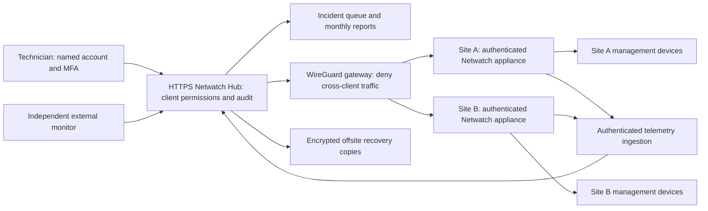

# Netwatch managed-service review and proposed solution

Reviewed 13 September 2026. This is an architecture and operations proposal, not a deployment change.

> **Updated client constraint:** use a lean Pi with a 1 GB memory budget and SD/USB flash storage. The newer [infrastructure evaluation](INFRASTRUCTURE-EVALUATION-2026-09-13.md) supersedes site-side Zabbix proxy/local monitoring-stack recommendations below. Heavy services and long-term retention belong centrally.

## Recommendation

Keep Farm Netwatch as the farm discovery and diagnostic appliance, and Netwatch Hub as the operator workspace. Keep WireGuard for private connectivity. Upgrade and narrow Kuma's responsibility to service availability. Before expanding the paid service, implement authenticated site access, customer isolation, protected backups, trustworthy reporting, and an incident workflow.

Pilot Zabbix as the monitoring engine for deeper infrastructure monitoring instead of building all metric collection, thresholds, dependencies and historical analysis into Netwatch. Introduce it only when pilot evidence justifies the additional operational burden. Do not run duplicate alerts for the same service from Netwatch, Kuma and Zabbix.

Planning assumption: an owner-operated service, initially tens of farm sites, with intermittent connectivity. Site count, budget, support hours and included labour remain to be confirmed. Capacity and commercial figures below are design targets, not measured promises.

## Evidence and limits

Inspected local application source, Compose definitions, installers and running container metadata. The running `/app/server.py` files in both Netwatch containers match their respective checkout files by SHA-256. Other running modules were not individually compared. The site status endpoint returned 200 without authentication; the hub sites endpoint returned 401 without authentication. No credential export was requested and no client settings were changed.

Running images include Kuma `1.23.17` and wg-easy `14`. The VPN container publishes hub, proxy, tunnel and administration ports on all IPv4/IPv6 host interfaces. This does not establish internet exposure: upstream firewall, NAT and IPv6 policy were not audited. Its live FORWARD chain has policy ACCEPT and accepts traffic entering/leaving wg0. Other filtering layers and end-to-end client reachability were not tested.

No existing graphify graph or executable was found; findings below are based on direct source review, not graph-derived evidence. This is not a penetration test, load test, full UI review or restoration exercise.

## Findings to address first

| Priority | Observed evidence | Impact and required change |
|---|---|---|
| Critical | `app/server.py:250` returns device credentials without an authentication guard. `:1148` exports settings, credential data, its key and the VPN configuration. The server binds all interfaces. | A party able to access the site API can obtain management secrets. Require user authentication and scoped hub machine credentials; restrict ingress to management networks. Protect reads as well as writes. |
| Critical | Live VPN FORWARD chain accepts wg0 traffic; hub Compose explicitly enables forwarding and assigns clients the shared VPN subnet. | Client separation is not enforced in this chain. Implement default-deny forwarding with explicit hub-to-site services and technician-to-assigned-site rules. Test from two actual client peers. AllowedIPs alone is not the customer authorization boundary. |
| High | `hub/app/auth.py` uses one shared password; `hub/app/server.py:45` allows persistent 30-day sessions. | Add named users, MFA, administrator/technician/customer-viewer roles, per-customer permissions, shorter sessions, login rate limits, CSRF protection and attributable audit events. A reverse-proxy login alone does not enforce tenant ownership inside APIs. |
| High | `hub/app/tunnels.py` opens relays on `0.0.0.0`; the relay accepts TCP connections without operator authentication. | Hub login protects creation, not use of an open relay. Restrict listeners to an authenticated management path, enforce assignment and expiry, log operator/target/reason, and revoke sessions on logout/offboarding as appropriate. Device authentication remains necessary. |
| High | `app/listener.py` dispatches messages from the ntfy topic; `app/config.py:68` defaults commands on. No publisher identity check is performed in this listener. | Default remote commands off. Authenticate notification publishers/subscribers. Run management actions through the authenticated hub with authorization and audit records. Actual topic ACLs were not inspected. |
| High | `app/creds.py` implements custom reversible obfuscation; export includes its key. `hub/app/backups.py` stores 14 JSON bundles locally. | Use established authenticated encryption and controlled key access. Encrypt complete backups before offsite storage with independent recovery keys. The existing bundles are sensitive recovery material, not encrypted backups. |
| High | `app/history.py:241` and `hub/app/sitehistory.py:67` calculate averages of received samples. | Missing periods and irregular sampling are not represented as elapsed-time coverage. Do not sell these figures as contractual service availability. Track unknown periods, collection coverage and maintenance explicitly. |
| Medium | `hub/app/poller.py` batches status, metrics and backup jobs through four workers; executor exit waits for jobs to complete. | Slow clients can delay subsequent polling. Separate heartbeat work from backups/deep diagnostics; use bounded queues, per-site budgets, jitter, backoff and poll-lag metrics. Load-test outage scenarios. |
| Medium | Both Flask entry points use `app.run`; site process also manages network changes and scanning. | Move serving to a production WSGI server and separate background workers. Do not blindly add web workers: startup must not duplicate scanners, pollers or VPN ownership. Split privileged networking into a narrowly scoped helper. |
| Medium | Shared wg-easy network namespace and fixed proxy range 8200–8231. | VPN recreation couples hub/proxy availability. With two proxy ports per site, the default range accommodates only 16 fully proxied sites. Move web access to authenticated HTTPS hostnames and separate the VPN gateway lifecycle. |

Existing strengths worth preserving: stable device identity, IP history, radio diagnostics, reachability checks, stale snapshots, local SQLite history, alert debounce, daily configuration backups, tunnel expiry and automatic rollback for certain network changes. Snapshot/history storage is useful but is not an acknowledged telemetry replay queue.

## Proposed architecture

Deploy central services on a dedicated maintained host/VM with reliable power and connectivity. Prefer an offsite location if the office is itself a monitored site or suffers frequent outages. Host identity, application and VPN in separate service lifecycles; protect administrative interfaces from general LAN access. Begin with tested recovery and independent monitoring before investing in automatic failover.

At each client, use a dedicated appliance on a management VLAN, wired Ethernet, reliable storage, UPS coverage and an outbound WireGuard connection. Keep existing Pi hardware where measurements show adequate headroom; do not assume every Pi can support additional monitoring workloads. Support overlapping client LANs using site-local probes and explicitly scoped relays rather than globally routing all client subnets.

Each site gets a unique revocable identity. First harden the existing pull API; subsequently add a durable local telemetry outbox with timestamps, sequence IDs, acknowledgements, retry/backoff, duplicate protection and bounded retention. Sites must continue collecting while the hub is unavailable. Never replay expired repair commands after reconnection.

Proposed hub records: Customer, Site, Asset, Monitor, Dependency, Incident, MaintenanceWindow, UserRole, RemoteSession, BackupRun and ChangeJob. Enforce customer ownership server-side on every access path, including exports, reports, proxies and background jobs. For the expanded central transactional model, plan PostgreSQL with migrations and backups; SQLite remains appropriate for small local queues/history.

## Monitoring that finds useful faults

| Layer | Measurements and initial cadence | Operational interpretation |
|---|---|---|
| Monitoring platform | External hub check and independent dead-man heartbeat every 60 seconds | Detect hub failure even when its own notifier cannot run. |
| Site appliance | Application heartbeat every 60 seconds; disk, temperature, memory, clock and storage health every 5 minutes | Separate a failed agent from a failed client network. |
| Internet | Gateway, multiple upstream targets, DNS resolution and HTTPS every 60 seconds | One blocked ICMP endpoint does not prove an internet outage. |
| VPN | Handshake age, active application probe and transfer counters | WireGuard inactivity alone does not prove a fault; interpret with keepalive and active probes. |
| Network equipment | SNMPv3 where supported: interface errors, loss, utilization, radio signal/noise and capacity every 1–5 minutes | Establish device-specific baselines before setting thresholds. Protect legacy read-only protocols on management networks. |
| CCTV/NVR | Device reachability plus supported recording/storage/channel-health checks every 1–5 minutes | A responding camera or open RTSP port does not prove recording. Validate actual recording where the model/API permits; otherwise mark recording health unverified. |
| Power | UPS battery, mains failure, runtime and PoE power state where supported | Explain groups of disappearing devices and distinguish observed power failure from a hypothesis. |
| Recovery | Backup age, result and restore-drill evidence | File creation alone does not establish recoverability. |

Use five visible states: healthy, degraded, down, unknown and maintenance. Show last observation and last successful collection separately. Preserve stale data with its timestamp; never show it as current green status.

Keep scans conservative: frequent lightweight probes for managed assets, slower inventory discovery, and scheduled/on-demand deep scans. Avoid continuously scanning all ports on fragile cameras and wireless equipment.

Set initial alert policy to three consecutive 60-second failures and two successful recovery checks, then tune from field results. Existing polling has different thresholds; this is a proposed policy. Critical confirmed recording/storage faults can use different urgency. Model dependencies: router → backhaul radio → switch → cameras. One failed radio should create one primary incident with affected downstream devices attached. A lost site heartbeat means visibility lost, not proof every camera is broken.

Every actionable incident needs an owner, severity, affected service, acknowledgement, timeline, maintenance context, next action and resolution. Deduplicate repeats and escalate unacknowledged incidents only within contracted coverage hours. Use a ticketing system already in use where possible; otherwise implement this minimum workflow before building billing features.

## Kuma, WireGuard and Zabbix decisions

**Kuma:** The repository comment claiming v2 removed Socket.IO is inaccurate: upstream still contains add/edit/delete monitor handlers. That does not prove this Python adapter is compatible. Upstream marks v1 Docker tags deprecated. Build a disposable migration environment from a protected backup, exercise login/create/tag/edit/delete/ping/DNS/status-page/push behavior actually used by Netwatch, verify history migration, then select an exact tested release/digest. Restore the old database with the old image for rollback; do not point an old image at a migrated database. See [security policy](https://github.com/louislam/uptime-kuma/blob/master/SECURITY.md) and [server handlers](https://github.com/louislam/uptime-kuma/blob/master/server/server.js).

**WireGuard:** Keep the protocol. Stage wg-easy v14→v15 migration and validate the custom `hub/app/wgeasy.py` adapter, enrollment, revocation, addressing and firewall policy. Upstream migration requires a controlled import/setup process; changing the image tag is insufficient. See [official migration guide](https://wg-easy.github.io/wg-easy/latest/advanced/migrate/from-14-to-15/).

**Zabbix:** Pilot an active proxy at one representative site for infrastructure metrics and outage buffering. Its proxies collect and buffer locally; central-server trigger processing means buffering is not independent local alert evaluation. Dependency rules can suppress downstream incident noise. Retain Netwatch discovery/diagnostics and let Hub summarize the resulting incidents. If adopted, assign each monitor and notification to one authoritative engine and phase out duplicates. See [proxies](https://www.zabbix.com/documentation/current/en/manual/distributed_monitoring/proxies) and [trigger dependencies](https://www.zabbix.com/documentation/current/en/manual/config/triggers/dependencies).

**ntfy:** Keep as a notification channel with authenticated access and topic ACLs, not as an anonymous management bus. See [access control](https://docs.ntfy.sh/config/#access-control).

## Monthly service design

| Package | Included deliverables | Boundaries to state |
|---|---|---|
| Monitor | Agreed managed assets, automated alerts, business-hours incident triage, monthly health report | Repairs and visits billed separately. |
| Manage | Monitor plus an explicit remote-support allowance, configuration backup and scheduled maintenance | Define supported equipment, labour allowance, overage and maintenance windows. |
| Priority | Manage plus explicitly staffed faster response and agreed preventive visits/recovery options | Offer after-hours response only when staffing exists; parts, travel and ISP charges must be explicit. |

Price from actual service cost: monthly infrastructure allocation + notification/ticket tooling + appliance reserve + expected support labour + travel allowance where included, divided by (1 − chosen gross margin). Charge onboarding separately for the inventory, network baseline, credentials, installation and remediation. Meter support time during the pilot before fixing prices. Avoid unlimited support commitments.

Sell response and maintenance obligations you control. Distinguish response time from restoration time, and monitored customer availability from your own platform uptime. A monthly report should include service downtime, unknown time, collection coverage, incidents resolved, response times, recurring faults, backup age and tested recovery, maintenance performed and recommended improvements.

Calculate availability from timestamped intervals with a maximum sample-validity horizon. Publish known-up / (known-up + known-down), alongside known-time / eligible-time coverage and unknown duration. Show planned maintenance separately under an agreed reporting policy. Never infer availability for missing periods. The existing AI report can draft commentary from verified records; it must not invent causes or calculate contractual statistics. Minimize client information sent to external AI services and make this optional per customer.

## Delivery sequence and acceptance gates

1. **Contain and secure:** authenticated site API and hub machine credentials, management ingress restrictions, tenant firewall policy, protected backups, command channel disabled by default. Deploy compatibility changes together so hub polling/restoration still works. Retain an out-of-band recovery path while changing VPN/firewall controls.
2. **Make monitoring trustworthy:** freshness/unknown states, incident ownership and suppression, independent monitoring, queue isolation and reliable reporting. Add collection-health dashboards before adding more monitors.
3. **Control lifecycle:** exact image digests, dependency/security review, staged releases, migration/rollback runbooks, production WSGI with single background-worker ownership, named users/MFA/audit and tested restore procedures.
4. **Pilot the paid service:** three representative clients, including a weak internet site, for 30 days. Trial Zabbix on one site if deeper infrastructure monitoring is needed. Measure alert usefulness, support minutes, storage growth, missed collections and recovery effort. Set commercial terms from those measurements.

Before wider rollout, demonstrate:

- An unauthenticated LAN user cannot read credentials/export/configuration or execute changes; machine identities have only necessary scope.
- Client A cannot access client B; one technician cannot access an unassigned client; revoked identities and tunnels stop working.
- WAN loss does not mark unobserved devices healthy or fabricate device outages. Buffered observations replay once with original timestamps.
- One upstream failure creates one primary incident; maintenance and recovery behave predictably.
- Killing the monitoring hub produces an alert from an independent system.
- A protected backup restores onto a spare appliance; hub state, identities, keys and required historical databases have separate recovery coverage. Existing site exports do not include full monitoring history or Kuma's database.
- Candidate Kuma/wg-easy releases pass integration checks and rollback using pre-migration data.
- Representative healthy and failing-site loads stay within chosen polling deadlines without backup jobs starving heartbeat work.

Proposed initial recovery targets: no more than 24 hours of configuration loss, backup immediately after important changes, and hub recovery within four staffed hours. These become promises only after successful drills and staffing review.

No running services, firewall rules, dependencies or client configurations were modified during this review.
